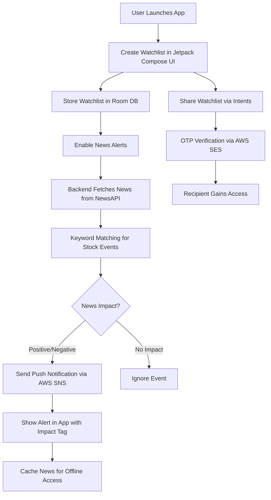

# 📈 News-Driven Stock Alert App  

A modern Android application that empowers users to **create stock watchlists** and receive **real-time alerts** based on financial news events (e.g., earnings, mergers) parsed from **NewsAPI**.  
The app also enables **secure watchlist sharing** with OTP verification and offers **offline support** for a seamless user experience.  

---

## 🚀 Features  

- 📰 **News-Based Alerts**: Backend parses financial news from **NewsAPI** using keyword matching to trigger alerts for user-selected stocks.  
- 📊 **Watchlist Management**: Create and manage stock watchlists with a sleek **Jetpack Compose** UI, stored locally in **Room DB** for offline access.  
- 🔐 **Secure Sharing**: Share watchlists via **Android Intents** (WhatsApp, Email, etc.) with **OTP verification** powered by **AWS SES** for privacy.  
- 📡 **Offline Support**: Queue alert preferences offline using **WorkManager** and cache news data for offline viewing.  
- 📈 **Analytics**: Track user engagement (e.g., most-watched stocks) with **AWS Pinpoint**.  
- 🎨 **Visual Feedback**: Color-coded news impact tags (**positive/negative**) and **swipe-to-remove** watchlist items in Jetpack Compose UI.  

---

## 🛠️ Tech Stack  

**Frontend**: Kotlin, Jetpack Compose, Room DB, WorkManager, Android Intents  
**Backend**: Spring Boot, NewsAPI  
**Cloud**: AWS (Elastic Beanstalk, DynamoDB, SES, SNS, Pinpoint)  

---

## 📂 Project Flow Diagram  

⚙️ Getting Started
✅ Prerequisites

Android Studio
 (latest version)

JDK 17+

AWS account with SES, SNS, DynamoDB, Elastic Beanstalk, and Pinpoint configured

NewsAPI key

🔧 Installation

Clone the repository:

git clone https://github.com/developer4949-code/stock-alert-app.git

Open the project in Android Studio.

Add your NewsAPI key and AWS credentials in the backend configuration (application.properties).

Build and run the Android app on an emulator or device.

Deploy the Spring Boot backend to AWS Elastic Beanstalk.

⚙️ Configuration

NewsAPI: Store API key securely in the backend.

AWS SES: Set up for OTP email delivery.

AWS SNS: Configure for push notifications.

Room DB: Handles local storage for watchlists automatically.

📱 Usage

Launch the app and create a watchlist by searching for stock symbols.

Enable alerts for specific news events (e.g., earnings, mergers).

Share watchlists via supported apps (WhatsApp, Gmail, etc.).

Recipients verify access with an OTP sent via email.

View cached news offline and manage watchlists seamlessly.

Alerts sync automatically when online.

⚡ Challenges & Solutions

Reliable News Parsing: Implemented keyword matching; plan to enhance with NLP.

Intent Compatibility: Tested across WhatsApp, Gmail for smooth sharing.

Offline Sync: Used WorkManager to queue and sync preferences seamlessly.

🔮 Future Enhancements

🤖 Add sentiment analysis for news impact scoring.

🌐 Support for more news APIs for broader coverage.

⚡ Customizable alert thresholds and frequency settings.

🤝 Contributing

Contributions are welcome!

Fork the repo

Create a feature branch

Submit a pull request 🚀

📜 License

This project is licensed under the MIT License – see the LICENSE
 file for details.
